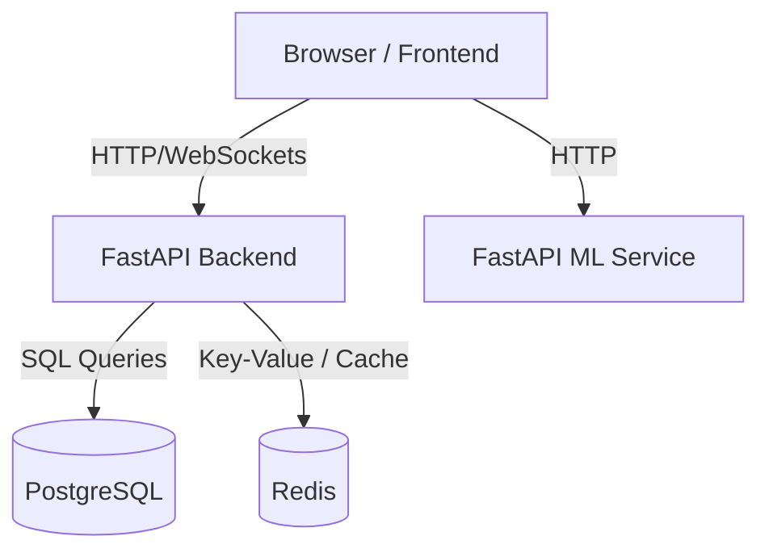

# AgroGuide Deployment Guide

This guide outlines practical, production-ready, and free/low-cost deployment strategies for AgroGuide.

## Architecture Overview



---

## 1. Frontend (Next.js)

### Recommended Platform: **Vercel**
Vercel offers the best native support for Next.js applications on their hobby/free tier.

### Deployment Steps:
1. Push your code to GitHub.
2. Sign in to [Vercel](https://vercel.com) using your GitHub account.
3. Import the repository and select the `frontend` folder as the root directory.
4. Set the following Environment Variables in the project settings:
   - `NEXT_PUBLIC_API_URL`: URL of the deployed FastAPI Backend (e.g., `https://agroguide-backend.onrender.com`).
   - `NEXT_PUBLIC_ML_SERVICE_URL`: URL of the deployed ML Service (e.g., `https://agroguide-ml.onrender.com`).
5. Click **Deploy**. Vercel will automatically build, optimize, and serve the application globally.

---

## 2. Backend (FastAPI) & ML Service

### Recommended Platform: **Render** or **Railway**
Render and Railway provide free/hobby tiers that support running Docker containers or native Python services.

### Deployment Steps (using Render):
1. Create a new **Web Service** on Render connected to your GitHub repository.
2. Choose **Docker** as the environment (since Dockerfiles are provided for both services).
3. Set the Root Directory:
   - For backend: `backend`
   - For ML service: `ml_service`
4. Set the Environment Variables:
   - **Backend Environment Variables**:
     - `DATABASE_URL`: Connection string from your database host.
     - `REDIS_URL`: Connection string from your Redis host.
     - `SECRET_KEY`: Long, randomly generated secure string for JWT tokens.
     - `SENTRY_DSN` (Optional): DSN for error monitoring.
   - **ML Service Environment Variables**:
     - `ML_DEMO_MODE`: Set to `True` (or `False` if trained models are present).
     - `MAX_IMAGE_UPLOAD_MB`: `5` (limit upload file sizes).
5. Click **Deploy**. Render will build the container from the Dockerfile and deploy it.

---

## 3. Database (PostgreSQL)

### Recommended Platform: **Supabase** or **Neon**
Supabase and Neon offer highly reliable, serverless, free-tier PostgreSQL databases.

### Deployment Steps (Supabase):
1. Sign up for a free account on [Supabase](https://supabase.com).
2. Create a new project and set a database password.
3. Navigate to **Project Settings -> Database** and copy the **Connection string** (URI format, transaction pooler or session pooler).
4. Run migrations using Alembic from your local development machine or CI/CD environment pointing to this production URI:
   ```bash
   DATABASE_URL="postgresql://<user>:<password>@<host>:<port>/postgres" alembic upgrade head
   ```

---

## 4. Cache & Queue (Redis)

### Recommended Platform: **Upstash**
Upstash provides a fully-managed, serverless Redis service with a generous free tier (10,000 commands/day).

### Deployment Steps:
1. Create a free account at [Upstash](https://upstash.com).
2. Create a new Redis database.
3. Copy the standard Redis connection URL (e.g., `rediss://default:<password>@<host>:<port>`).
4. Provide this URI as the `REDIS_URL` environment variable for your deployed FastAPI backend.
