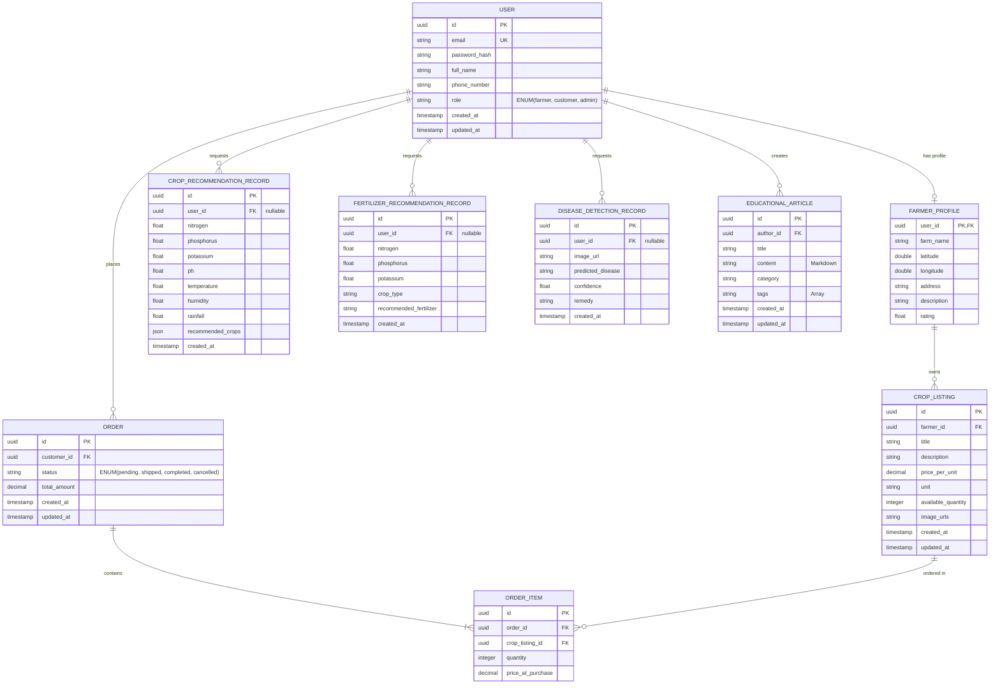

## Context

AgroGuide is a production-quality AI-powered AgriTech platform. This design document establishes the architectural blueprint for the platform (Phase 0). The design emphasizes modularity, separation of concerns, strict type safety, scalable API boundaries, robust authentication, and ML service isolation, without writing any application code or bootstrapping frameworks yet.

### Key Constraints & Stakeholders
- **Users**: Farmers (sellers, recommendation consumers), Customers (buyers, discoverers), and Admins (content managers, platform monitors).
- **Security**: Strict credential isolation, no hardcoded secrets, Role-Based Access Control (RBAC).
- **Scalability**: Decoupled Next.js frontend, FastAPI backend, and isolated ML services.

---

## Goals / Non-Goals

### Goals:
- **Modular Monorepo Structure**: Define a clear, maintainable layout for the frontend, backend, ML services, and devops configuration.
- **Strict Separation of Concerns**: Isolate API gateways from machine learning model inference and training pipelines.
- **Robust Schema & Data Integrity**: Model database relationships, migrations path (Alembic), caching strategy (Redis), and ML parameters.
- **Secure Authentication Framework**: Define JWT (Access + Refresh tokens), Google OAuth 2.0 flow, and RBAC authorization decorators.
- **Predictable API Boundaries**: Establish request/response payloads, HTTP verbs, and path structures for all major features.

### Non-Goals:
- **Code Implementation**: No application code, server configuration files, Dockerfiles, or migrations will be generated in this phase.
- **Production DevOps Setup**: Infrastructure provisioning, production domain setup, and pipeline configurations are deferred.
- **External Integration Execution**: No direct integration with Cloudinary, LLM API, or Google Client libraries in this phase.

---

## Decisions

### 1. Monorepo Folder Structure
We will adopt a modular monorepo layout that isolates dependencies while keeping the project unified for CI/CD and localized configuration.

```
agroguide-monorepo/
├── README.md
├── docker-compose.yml
├── .env.example
├── .github/
│   └── workflows/
│       └── ci-cd.yml
├── backend/
│   ├── Dockerfile
│   ├── requirements.txt
│   ├── alembic.ini
│   ├── alembic/
│   │   └── versions/
│   └── app/
│       ├── main.py
│       ├── core/
│       │   ├── config.py
│       │   ├── security.py
│       │   ├── database.py
│       │   └── cache.py
│       ├── models/
│       │   ├── base.py
│       │   ├── user.py
│       │   ├── marketplace.py
│       │   ├── recommendations.py
│       │   └── educational.py
│       ├── schemas/
│       │   ├── user.py
│       │   ├── marketplace.py
│       │   ├── recommendations.py
│       │   └── educational.py
│       ├── api/
│       │   ├── v1/
│       │   │   ├── api.py
│       │   │   └── endpoints/
│       │   │       ├── auth.py
│       │   │       ├── marketplace.py
│       │   │       ├── crop.py
│       │   │       ├── fertilizer.py
│       │   │       ├── disease.py
│       │   │       ├── education.py
│       │   │       └── farmers.py
│       └── services/
│           ├── auth.py
│           ├── marketplace.py
│           ├── ml_client.py
│           └── location.py
├── frontend/
│   ├── Dockerfile
│   ├── package.json
│   ├── tsconfig.json
│   ├── tailwind.config.js
│   ├── src/
│   │   ├── app/
│   │   │   ├── layout.tsx
│   │   │   ├── page.tsx
│   │   │   ├── (auth)/
│   │   │   │   ├── login/
│   │   │   │   └── register/
│   │   │   ├── (dashboard)/
│   │   │   │   ├── admin/
│   │   │   │   ├── farmer/
│   │   │   │   └── customer/
│   │   │   ├── marketplace/
│   │   │   │   ├── page.tsx
│   │   │   │   └── [id]/
│   │   │   ├── recommendations/
│   │   │   │   ├── crop/
│   │   │   │   └── fertilizer/
│   │   │   ├── disease/
│   │   │   └── educational/
│   │   ├── components/
│   │   │   ├── ui/
│   │   │   └── shared/
│   │   ├── hooks/
│   │   ├── lib/
│   │   │   ├── api.ts
│   │   │   └── utils.ts
│   │   └── types/
└── ml_service/
    ├── Dockerfile
    ├── requirements.txt
    ├── main.py
    ├── models/
    │   ├── crop_xgb.json
    │   └── fertilizer_xgb.json
    ├── pipelines/
    │   ├── train_crop.py
    │   └── train_fertilizer.py
    └── utils/
```

### 2. Backend & Frontend Module Boundaries

#### Backend Modules
- **Core (Shared)**: Config loading via Pydantic settings, DB connection pooling via SQLAlchemy 2.0 (asyncpg), Redis connection pool, custom global exception handlers, Sentry integration.
- **Auth (Identity)**: JWT token generation/validation (HMAC-SHA256), OAuth2 flow, password hashing (bcrypt), role guard middleware.
- **Marketplace**: Handle CRUD for items, stock inventory concurrency management (optimistic locking), checkout transactions.
- **ML Gateway Client**: Client wrapper to forward requests to the isolated `ml_service` with circuit breaker and fallback mechanisms.
- **Geo-Query Service**: SQL spatial helpers (PostgreSQL cube/earthdistance or PostGIS depending on overhead requirements) for distance-based calculations.
- **AI Assistant Service**: Manages OpenAI/Anthropic/Gemini API calls, handles context construction, system prompts, and streaming responses to the frontend.

#### Frontend Routing & Routes
- `/` - Landing page with hero section, system introduction, and quick action links.
- `/login` / `/register` - Authentication screens.
- `/marketplace` - Main browse and search catalog.
- `/marketplace/[id]` - Crop detail page with quantity controls and seller info.
- `/recommendations/crop` - Interactive soil-metrics inputs with diagnostic reports.
- `/recommendations/fertilizer` - Fertilizer diagnostic form and output suggestions.
- `/disease` - Drag-and-drop leaf picture upload and prediction logs.
- `/educational` - Blog/guide catalog and reading view.
- `/farmer/dashboard` - Inventory manager, order status board, sales overview.
- `/customer/dashboard` - Purchased orders tracking, saved farmers, search logs.
- `/admin/dashboard` - System health stats, user list management, and content creation tools.

### 3. Database Entity Plan & Relationships

#### Database Schema Diagram (Mermaid)



### 4. API Boundary Plan

All backend endpoints are prefixed with `/api/v1`.

| Module | Method | Path | Auth/Role | Request Body | Response Status |
| :--- | :--- | :--- | :--- | :--- | :--- |
| **Auth** | POST | `/auth/register` | Public | `{ email, password, full_name, phone, role }` | 201 Created |
| **Auth** | POST | `/auth/token` | Public | `{ email, password }` | 200 OK (Access + Refresh token) |
| **Auth** | POST | `/auth/refresh` | Public | `{ refresh_token }` | 200 OK (New access token) |
| **Auth** | POST | `/auth/google` | Public | `{ oauth_credential_token }` | 200 OK (Access + Refresh token) |
| **Marketplace**| GET | `/marketplace` | Public | Query params: `search, category, limit, offset` | 200 OK |
| **Marketplace**| POST | `/marketplace/listings` | Farmer | `{ title, description, price, unit, quantity, images }` | 201 Created |
| **Marketplace**| GET | `/marketplace/listings/{id}` | Public | None | 200 OK |
| **Marketplace**| POST | `/marketplace/orders` | Customer | `{ items: [{ listing_id, quantity }] }` | 201 Created |
| **Marketplace**| PATCH | `/marketplace/orders/{id}` | Farmer, Customer| `{ status }` | 200 OK |
| **ML** | POST | `/recommendations/crop` | Public / User | `{ N, P, K, pH, temp, humidity, rainfall }` | 200 OK |
| **ML** | POST | `/recommendations/fertilizer` | Public / User | `{ N, P, K, crop_type }` | 200 OK |
| **ML** | POST | `/disease/detect` | Public / User | Multipart Form (Image file) | 200 OK |
| **Location** | GET | `/farmers/search` | Public | Query params: `lat, lon, radius` | 200 OK |
| **AI Assistant**| POST | `/assistant/chat` | Authenticated | `{ message, history: [...] }` | 200 OK (Stream / Text) |
| **Education** | POST | `/educational/articles`| Admin | `{ title, content, category, tags }` | 201 Created |

### 5. Authentication & RBAC Plan

1. **Token Flow**:
   - **Access Token**: JWT stored in short-lived frontend state or memory. Valid for 15 minutes. Contains `sub` (User ID) and `role` (Farmer, Customer, Admin).
   - **Refresh Token**: Stored in a secure, `HttpOnly`, `SameSite=Strict`, `Secure` cookie. Valid for 7 days. Used to fetch a new access token when expired.
2. **Google OAuth 2.0 Flow**:
   - Next.js uses Google Login API to obtain an ID token.
   - The token is sent to backend `/api/v1/auth/google`.
   - Backend validates the token via Google APIs, checks if user exists. If yes, logins. If no, creates new Customer role user and logins.
3. **Backend Middleware Enforcement**:
   - Standard FastAPI dependency: `get_current_user` checking signature, expiration, and status.
   - Role guard dependency: `RoleChecker(allowed_roles=["farmer", "admin"])`.
     ```python
     class RoleChecker:
         def __init__(self, allowed_roles: list[str]):
             self.allowed_roles = allowed_roles
         def __call__(self, current_user: User = Depends(get_current_user)):
             if current_user.role not in self.allowed_roles:
                 raise HTTPException(status_code=403, detail="Permission denied")
             return current_user
     ```

### 6. ML Service Integration Plan

To prevent high-overhead ML calculations from blocking FastAPI's ASGI event loop:
1. **Separation**: The ML code runs in a distinct service container (`ml_service`), hosting a FastAPI server wrapping Scikit-Learn pipelines and XGBoost models.
2. **Communication**: The main backend contacts `ml_service` via HTTP client connection pool (`httpx.AsyncClient`).
3. **Caching**: The backend utilizes Redis to cache recommendations using key formatting: `recommendation:crop:hash(params)`.
4. **Disease Detection Storage**: Leaf images are uploaded to Cloudinary first. The backend then passes the secure Cloudinary image URL to the `ml_service` which downloads, resizes, and runs classification inference, returning the label. This avoids uploading large files multiple times.

---

## Risks / Trade-offs

- **[Risk] Monorepo Build Complexity** → *Mitigation*: Configure independent Docker targets so frontend changes do not rebuild the backend or ML service in the CI/CD pipeline.
- **[Risk] PostGIS Database Size Overhead** → *Mitigation*: For initial geolocation discovery, use pure Euclidean distance SQL queries using latitude/longitude indexes. Scale to PostGIS only if geospatial complexity demands it.
- **[Risk] ML Inference Latency** → *Mitigation*: Ensure heavy recommendations (XGBoost) are aggressively cached in Redis. Pre-load model weights into memory during ML service startup.
- **[Risk] LLM API Cost & Rate Limits** → *Mitigation*: Set system limits on chatbot calls per user role, implement token consumption logging, and cache repeated static agricultural query patterns.
